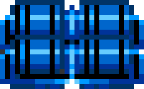

<div align="center">
    
    <br/>
    <h1>X-1 ALPHA</h1>  
</div>


## Work In Progress

X-1 ALPHA est un mini-jeu de livraison qu'on joue sur le clavier.

Écris en vanilla JS


[https://pierretl.github.io/x1-alpha/](https://pierretl.github.io/x1-alpha/)

## Installation

```bash
# Cloné le dépot
git clone https://github.com/pierretl/x1-alpha.git

# On se place dans le répertoire
cd x1-alpha/

# Installer les dépendances du projet
npm install -y
```

## Build & Run

|Commande|Effet|
|--------|-----|
|`gulp build`|Build|
|`gulp watch`|Run + lancement serveur local|